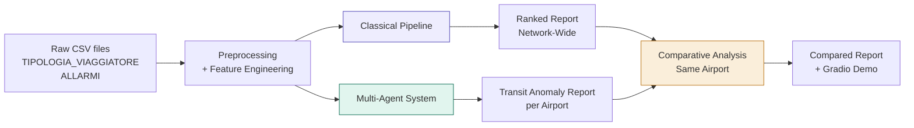
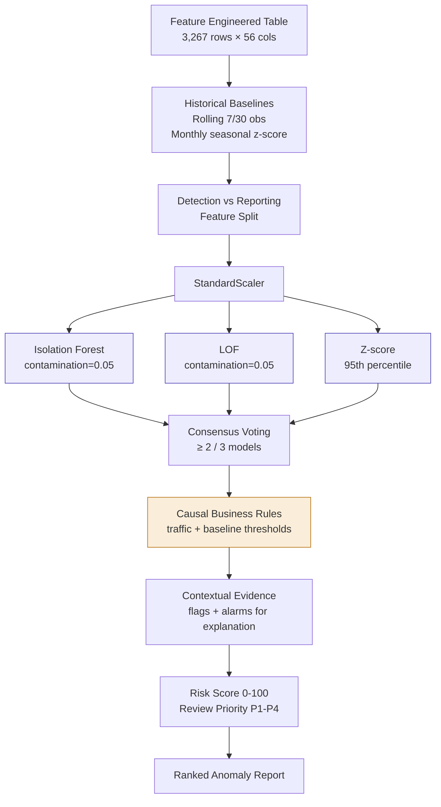
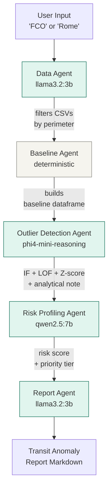

# Classical Pipeline vs Multi-Agent System for Airport Transit Anomaly Detection

**Reply Project: Machine Learning Project, A.A. 2025/26**

**Team 1:** Kassymzhomart Kalkayev 813641, Davoud Danish 807901, Orfeo Sirianni 817511

---

## Table of Contents

1. [Section 1: Introduction](#section-1--introduction)
2. [Section 2: Methods](#section-2--methods)
3. [Section 3: Experimental Design](#section-3--experimental-design)
4. [Section 4: Results](#section-4--results)
5. [Section 5: Conclusions](#section-5--conclusions)
6. [How to run](#how-to-run)
---

## Section 1: Introduction

Border control authorities and airport operators handle large volumes of passenger transits every day, each associated with rich metadata: timestamp, route, nationality, document type, control outcome, and security alerts. Today most anomaly detection in this domain is reactive, incidents are addressed after the fact. A proactive analytical system could identify suspicious patterns before they escalate into operational risks or security incidents.

This project addresses exactly this gap. The goal is to implement the anomaly detection task twice: once with a classical machine learning pipeline, and once with a multi-agent system based on local large language models. We then produce a comparative analysis to argue which approach is more convenient and under what operational conditions.

The dataset combines two sources: a passenger transit log (`TIPOLOGIA_VIAGGIATORE.csv`) and a security alarms log (`ALLARMI.csv`), both containing approximately one year of records from Italian airports. There are no ground-truth labels indicating whether a given observation is "truly" anomalous, the task is unsupervised retrospective anomaly scoring, where the output is a ranked alert queue for analyst review rather than a binary classification.

The high-level workflow we built is the following:



---

## Section 2: Methods

### 2.1 Environment

The project runs entirely on a local machine with Python 3.12. The classical pipeline requires only standard scientific libraries (`pandas`, `numpy`, `scikit-learn`, `matplotlib`). The multi-agent system runs four locally-hosted Ollama models orchestrated through `langchain` and `langgraph`. No external API calls are made, inference cost is the local GPU only.

### 2.2 Data preprocessing

Both raw CSVs contain inconsistent columns, mixed date formats, placeholder values (`N.D.`, `???`, `N/C`) and broken numeric fields (`pax`, `~`, scientific notation). The preprocessing harmonises them:

- Drops low-quality columns and duplicates
- Standardises gender values, country codes (3-letter ISO), and text casing
- Cleans numeric passenger counts and recovers missing values via the logical chain `ENTRATI ≥ INVESTIGATI ≥ ALLARMATI`
- Translates all column names to English
- Saves the cleaned datasets to disk for both pipelines to share

### 2.3 Feature engineering

We aggregate at `date × route_airport`, where `route_airport` is the concatenation of departure and arrival IATA codes. This grain guarantees uniqueness, aligns with operational behavior, and provides the most precise level for anomaly detection. The resulting table contains **3,267 rows over 534 routes** with 56 columns.

Feature groups:

- **Calendar features**: year, month, day, weekday, weekend flag
- **Base operational features**: entries, investigated, flagged, investigation rate, flag rate, conditional flag rate
- **Segment-level features**: per route-day aggregates (count, mean, max) computed by nationality, document type, airline, and control result, capturing passenger heterogeneity
- **Case-based features**: counts and densities derived from the alarms dataset, merged on `date + route_airport`
- **Temporal change features**: lag-1, absolute difference, and percentage change on entries, investigations, flags, and rates, capturing day-to-day shifts
- **Volume flags**: `is_low_volume` (<10 entries) and `is_low_volume_50` (<50 entries), preserved rather than discarded because ~70% of route-days have few entries

### 2.4 Classical pipeline



Key methodological choices:

**No train/test split.** The dataset has no ground-truth anomaly labels. A conventional supervised train/test split would only simulate validation without real labels. Instead, the pipeline performs retrospective unsupervised scoring on the full cleaned dataset. The objective is not to predict a known label but to identify observations that deviate from historical traffic behavior and should be prioritized for analyst review. The evaluation uses operational criteria: anomaly rate, agreement between detectors, stability under different contamination thresholds, and interpretability of the final alert queue.

**Detection vs reporting feature separation.** We split features by causal role. Detection features describe traffic behavior and historical deviations, they exist before any operational intervention. Reporting features describe consequences (flag rates, investigation outcomes, alarm cases). Using consequence-based features for detection would create leakage: an observation may look anomalous *because* it was already investigated and flagged. The detection layer therefore uses only detection features; reporting features are added back during post-processing to explain anomalies in operational terms.

**Causal rules vs contextual evidence.**  
To avoid information leakage, we distinguish between signals that can generate an anomaly flag and signals that can only help explain it after detection.
Causal rules are based on traffic behavior and historical baselines. These are considered valid anomaly triggers because they describe what is unusual in the transit flow itself, before relying on investigation or alarm outcomes.
Contextual evidence includes variables such as flag-rate spikes, alarm-density indicators, investigation rates, and case records. These variables are operationally useful, but they may reflect the result of a control process rather than an independent cause of abnormality. For this reason, they do not independently determine the final anomaly label. Instead, they are used in the explanation layer and may slightly influence review prioritization.
The system detects unusual traffic behavior first, then uses alarm and investigation information to help analysts interpret why the alert may matter.

**Three complementary detectors.** Isolation Forest captures global multivariate outliers (joint feature space). LOF captures local density anomalies (neighborhood-based). Multivariate Z-score captures extreme single-feature deviations. Each method captures a different anomaly concept, so consensus voting (at least 2 of 3 agree) reduces dependence on any single algorithm. The `contamination=0.05` parameter is fixed across methods so each model has the same anomaly budget, the value of consensus voting comes from *which* observations they flag, not *how many*.

**Causal business rules** are applied on top of the model consensus:

| Rule | Threshold | Captures |
|---|---|---|
| `rule_entries_spike` | entries_dev_ratio7 > 3 | Traffic spike above 3× recent baseline |
| `rule_high_residual_z` | abs(entries_residual_z) > 2 | Seasonal anomaly beyond 2σ |
| `rule_above_route_average` | entries_vs_route_mean > 3 | Traffic unusually high compared with the route historical mean |

The final anomaly label is:

`final_anomaly = consensus_anomaly OR causal_rule_any`

The following indicators are retained only as contextual evidence:

| Contextual signal | Meaning |
|---|---|
| `context_flag_rate_spike` | Flag rate above recent baseline |
| `context_high_alarm_density` | Alarm density in the top 5% |

These contextual signals are included in the anomaly explanation and risk prioritization, but they do not independently create a final anomaly.

**Risk score and review priority.** A weighted 0-100 operational severity index combines model agreement (40%), rule strength (25%), traffic spike (20%), and seasonal residual (15%). It is **not a calibrated probability of threat**, it is a ranking signal. Flagged anomalies are then assigned `P1 immediate review` to `P4 monitor` based on percentile thresholds within the flagged set, providing an actionable queue.

**Sensitivity analysis.** Without ground-truth labels we cannot measure precision or recall, but we can check stability: does the consensus flagged set change drastically when contamination varies? We re-run the three models for contamination ∈ {3%, 5%, 7%, 10%} and observe how the consensus rate evolves. Stability supports the validity of the chosen threshold.

### 2.5 Multi-Agent System



Five agents orchestrated through a LangGraph DAG. Each agent reads from and writes to a shared `AgentState` dictionary that carries the data forward without intermediate file I/O.

| Agent | Model | Role |
|---|---|---|
| Data Agent | `llama3.2:3b` | Extracts the IATA code from natural-language input and filters the cleaned CSVs |
| Baseline Agent | deterministic (no LLM) | Builds the daily route-day baseline table |
| Outlier Detection Agent | `phi4-mini-reasoning` | Runs the three detection methods, applies consensus voting, and writes an analytical note |
| Risk Profiling Agent | `qwen2.5:7b` | Produces a structured risk profile and operational notes using deterministic risk scores, risk levels, and review priorities computed from model agreement, causal rules, traffic spikes, seasonal residuals, and alarm-density evidence |
| Report Agent | `llama3.2:3b` | Generates the final transit anomaly report combining structured tables and an LLM-written interpretation paragraph |

**Design choice, deterministic Baseline Agent.** During development we tested an LLM-driven version of the Baseline Agent and observed frequent numerical hallucinations on rolling-average and z-score calculations. We replaced it with a deterministic Python tool to guarantee accuracy and reproducibility. This is a practical engineering trade-off, validated with the project supervisor: LLMs are kept where reasoning and interpretation matter (Outlier Detection, Risk Profiling, Report); deterministic code is used where precise numerics are essential.

**Model choice rationale.**

- `llama3.2:3b` (3B parameters) for the Data Agent: task is simple regex-like extraction
- `phi4-mini-reasoning` (3.8B) for the Outlier Detection Agent: chosen for strong reasoning capabilities at a small size; needed to interpret detection results
- `qwen2.5:7b` (7B) for the Risk Profiling Agent: needed for structured JSON output and contextual evaluation
- `llama3.2:3b` for the Report Agent: narrative paragraph generation only, the structured content is computed in Python

**Prompt injection guard.** The Data Agent uses the LLM to extract an IATA code, but a deterministic regex check then verifies that the chosen code actually appears in the user's input. This prevents prompt injection from changing the airport silently.

### 2.6 Comparative analysis

The classical pipeline produces a network-wide ranked report. The multi-agent system works one airport at a time. To enable a fair comparison we re-run the classical logic on the same perimeter chosen by the user in the multi-agent pipeline, producing two `comparison_ready.csv` files for the same airport. The comparative analysis then computes:

- **Execution time** of each pipeline (separate timers)
- **Agreement metrics**: Jaccard index, overlap rate, anomalies exclusive to each approach
- **Output format comparison**: structured CSV vs structured CSV plus natural-language report

The final deliverable is a `compared_report_<AIRPORT>.md` that includes both timers side by side, the agreement metrics, the multi-agent narrative report, and an interpretation paragraph.

---

## Section 3: Experimental Design

### 3.1 Purpose

We assess whether the multi-agent approach provides measurable advantages over a well-designed classical pipeline along four dimensions: detection quality, interpretability, computational cost, and adaptability.

### 3.2 Baselines

The classical pipeline itself acts as the baseline for the multi-agent comparison. Both systems use the same three detection methods (Isolation Forest, LOF, Z-score) with `contamination=0.05`, and both produce a ranked anomaly report. Methodological parity is enforced wherever possible: no train/test split in either, same consensus voting threshold, same overall architecture.
For the final reported experiment we use FCO as the reference comparison airport, because it is the largest and richest perimeter in the dataset. However, the notebook supports any valid IATA airport code which is in the dataset. For each run, the classical airport-specific subset and the MAS output are generated on the same selected perimeter.

### 3.3 Evaluation metrics

Since both pipelines are unsupervised, we cannot compute precision, recall, or F1. Instead the evaluation is multidimensional:

**Quantitative**
- Number of anomalies flagged by each pipeline on the same airport
- Jaccard index between the two flagged sets
- Number of exclusive detections per pipeline
- Distribution of risk levels (CRITICAL/HIGH/MODERATE/LOW)

**Qualitative**
- Interpretability of outputs (numeric scores vs natural-language explanations)
- Actionability for a human operator
- Quality of the transit anomaly narrative report

**Operational**
- End-to-end execution time
- Number of LLM calls per run
- Approximate inference cost (local GPU only, no API)
- Adaptability to data schema changes (qualitative assessment)

### 3.4 Sensitivity testing

The classical pipeline includes a sensitivity analysis on the contamination parameter (3%, 5%, 7%, 10%) to assess stability. The multi-agent pipeline can be re-run on different airports to verify behavioral consistency across perimeters.

---

## Section 4: Results


### 4.1 Main findings

On FCO (Fiumicino), both pipelines analysed **579 route-day observations** and flagged a significant and largely overlapping set of anomalies. The classical pipeline found 33 final anomalies (5.70%), the multi-agent system 40 (6.91%). With a **Jaccard index of 0.78**, the two pipelines agree on 32 out of 41 distinct flagged observations, confirming that they are measuring the same underlying phenomenon while capturing it from slightly different angles. The anomalies exclusive to the multi-agent system reflect differences in risk profiling, contextual evidence usage, and agentic post-processing, rather than a different evaluation perimeter. The anomaly exclusive to the classical pipeline reflects differences in feature engineering and deterministic post-processing.
The classical pipeline ran in **3.21 seconds**; the multi-agent system in **134.54 seconds** (the duration might vary depending on the hardware) a 41.9× slowdown driven by sequential LLM calls. The multi-agent system's added value lies not in speed but in the contextual narrative it produces alongside the structured output.

### 4.2 Quantitative comparison

The table below is generated by the notebook and stored in `io/compared_report/comparison_summary_FCO.csv`.

| Metric | Classical (FCO subset) | Multi-Agent (FCO) |
|---|---|---|
| Total observations | 579 | 579 |
| Final anomalies | 33 | 40 |
| Anomaly rate | 5.70% | 6.91% |
| Execution time (s) | 3.21 | 134.54 |
| Inference cost | ~0 | local GPU only |

### 4.3 Agreement analysis

| Metric | Value |
|---|---|
| Overlapping anomalies | 32 |
| Jaccard index | 0.7805 |
| Overlap vs classical | 96.97% |
| Overlap vs multi-agent | 80.00% |
| Classical-only | 1 |
| Multi-Agent-only | 8 |

The high overlap confirms that the two pipelines are detecting largely similar anomalous patterns. The classical pipeline captures almost all MAS anomalies from its own flagged set, while the MAS adds 8 additional anomalies. This suggests that the MAS is more sensitive in the FCO perimeter, likely because its post-processing and risk interpretation preserve more contextual cases.

### 4.4 Qualitative example

The top anomaly flagged by the multi-agent system is `SAW_FCO` on 2024-02-24, corresponding to Istanbul→Roma. It has 12 entries, a flag rate of 8.33%, a risk score of 90.00, a CRITICAL risk level, and a `P1 - immediate review` priority. The evidence type is `Model + causal rules`, meaning that both statistical detection and business-rule logic contributed to the final alert.

The classical pipeline produces an auditable ranked CSV with anomaly scores, rule flags, risk levels, and review priorities. The multi-agent system produces the same kind of structured output plus a natural-language transit anomaly report, making it more useful for targeted airport-level investigation.

The classical output is auditable and reproducible at network scale; the multi-agent output is contextual and operator-friendly for targeted perimeter investigation.

The top 10 anomalies by risk score from the multi-agent system on FCO:

| Date | Route | City | Entries | Flag rate | Risk score | Risk level | Priority |
|---|---|---|---:|---:|---:|---|---|
| 2024-02-24 | SAW_FCO | ISTANBUL_ROMA | 12 | 8.33% | 90.00 | CRITICAL | P1 |
| 2024-02-28 | JED_FCO | JEDDAH_ROMA | 64 | 0.00% | 90.00 | CRITICAL | P1 |
| 2024-02-22 | IKA_FCO | TEHRAN_ROMA | 48 | 2.08% | 78.25 | CRITICAL | P2 |
| 2024-01-25 | IKA_FCO | TEHRAN_ROMA | 39 | 0.00% | 77.34 | CRITICAL | P2 |
| 2024-01-18 | IST_FCO | ISTANBUL_ROMA | 10 | 0.00% | 66.23 | CRITICAL | P2 |
| 2024-01-11 | TIA_FCO | TIRANA_ROMA | 1 | 0.00% | 58.29 | HIGH | P2 |
| 2024-01-26 | TIA_FCO | TIRANA_ROMA | 353 | 4.53% | 52.50 | HIGH | P2 |
| 2024-01-13 | TIA_FCO | TIRANA_ROMA | 242 | 9.92% | 46.51 | HIGH | P2 |
| 2024-08-01 | TIA_FCO | TIRANA_ROMA | 402 | 7.96% | 45.44 | HIGH | P3 |
| 2024-01-03 | TIA_FCO | TIRANA_ROMA | 35 | 0.00% | 44.88 | HIGH | P3 |

The MAS report also shows that, among the 40 final anomalies, 21 were supported by model consensus, 28 were triggered by business rules, and 9 were supported by both model consensus and business rules. The average risk score over the analysed observations was 4.41.

### 4.5 Figures

The notebook generates the following figures, saved in `io/classical_report/images/`:

- `classical_feature_importance.png` : top 15 detection features by Isolation Forest importance
- `classical_anomaly_overview.png` : anomaly rate by detection layer + breakdown by evidence type

The deviation ratio, monthly z-score, and route mean dominate the classical feature importance ranking, confirming that the Data Preparation step (rolling baselines, monthly seasonal baseline) drives most of the detection. The multi-agent system reuses the same core detection logic on a selected perimeter, while its added value comes from risk profiling and report generation rather than from a broader feature space.
---

## Section 5: Conclusions

### 5.1 Take-away

Our comparison suggests that a classical pipeline remains the more reliable choice when the target metrics are clearly defined and reproducibility is a priority. It runs in seconds, produces deterministic results, and scales naturally across the entire route network. The multi-agent system excels at producing contextual, human-readable explanations that a statistical score alone cannot deliver, but at higher computational cost and limited to one perimeter at a time.

The two approaches are therefore **complementary rather than interchangeable**. A realistic production system would use the classical pipeline for continuous network-wide monitoring (the first line of triage), and the multi-agent system for on-demand investigation of flagged perimeters with contextual reporting (the second line of analysis). The classical pipeline tells an operator *what* is anomalous; the multi-agent system tells them *why it might matter*.

A second take-away concerns the design of the multi-agent system itself. We deliberately kept the Baseline Agent deterministic, running an LLM where precise numerics are required produced frequent hallucinations. We believe that an hybrid format would be a very strong solution to this task.

### 5.2 Open questions and next steps

Several questions remain beyond the scope of this work:

1. **No ground-truth labels.** Both pipelines produce alert queues, not supervised classifications. A natural extension would be a small human-labelled evaluation set on a single airport, allowing precision/recall to be computed retroactively.
2. **Single-airport multi-agent scope.** The MAS works on one perimeter at a time. Scaling network-wide would require either a supervisor agent that orchestrates parallel runs, or a different architecture where the agents operate on aggregated representations of multiple airports.
3. **Hard-coded thresholds.** Both pipelines use fixed thresholds (`contamination=0.05`, `dev_ratio > 3`, `|z| > 2`). Adaptive thresholds based on route-specific history could reduce false positives on sparse routes.
4. **Streaming vs batch.** The current setup runs in batch mode on historical data. A real deployment would require streaming ingestion and incremental baselines, a non-trivial extension for both pipelines but particularly demanding for the multi-agent version.
5. **Better evaluation of LLM agents.** Without ground truth we cannot easily score the quality of the agent's reasoning. Future work could compare agent outputs against expert reviewers on a small held-out sample.

---

## How to run

### Prerequisites

- Python 3.12
- Ollama installed and running locally ([ollama.com](https://ollama.com))
- Approximately 12 GB of disk space for the three Ollama models

### Setup

1. Clone the repository and place the two raw CSVs in `src/io/`:
   - `src/io/TIPOLOGIA_VIAGGIATORE.csv`
   - `src/io/ALLARMI.csv`

2. Pull the three Ollama models:
   ```bash
   ollama pull llama3.2:3b
   ollama pull phi4-mini-reasoning
   ollama pull qwen2.5:7b
   ```

3. Open `main.ipynb` in VS Code or Jupyter and run all cells in order. The multi-agent section will prompt for an airport perimeter: type `FCO`, `MXP`, `LIN`, `NAP`, or any IATA code appearing in the dataset.


4. The last section launches a Gradio interface for interactive demos. Install Gradio first (`pip install gradio`) and run the cell, the interface opens inline in the notebook or in a browser tab.

### Outputs

After running, the following files are produced in `io/`:

- `io/preprocessing/`: cleaned CSVs
- `io/feat_engineering/feat_engineered.csv`: engineered feature table
- `io/classical_report/`: full classical outputs (full dataset, ranked report, summary JSON, sensitivity)
- `io/classical_report/classical_<AIRPORT>/`: airport-specific classical subset
- `io/classical_report/images/`: PNG figures
- `io/agent_report/`: multi-agent outputs (scored dataframe, comparison-ready CSV, summary JSON, transit anomaly report)
- `io/compared_report/`: final comparative analysis (CSV summary + Markdown report)

---

## Academic integrity note

The code in `main.ipynb` was written by the team. Generative AI tools were used as a learning and refactoring aid (in particular for clarifying methodological choices, debugging, and improving narrative quality). All design decisions, model choices, and methodological trade-offs were made by the team. No code was copied from other teams.
